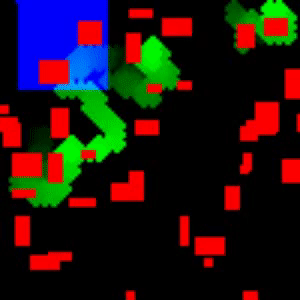
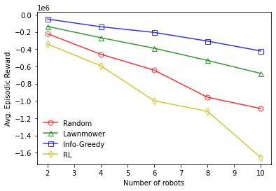
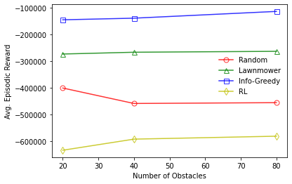
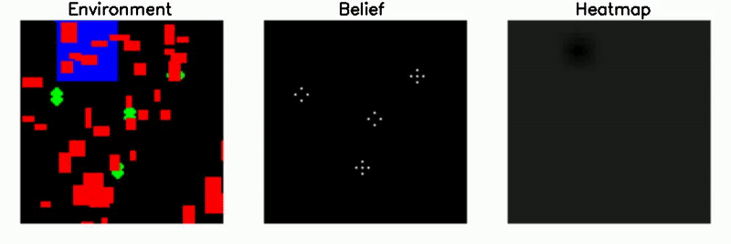

# Persistent-Monitoring using Multi-Robot (UAV-UGV) Coordination
## CMSC818B Course Project
## Members:  Jingxi Chen,  Md Ishat E Rabban,  Vishnu Dutt Sharma,  Kulbir Singh Ahluwalia

Persistent Monitoring using multiple ground vehicles has several applications including surveillance, patrolling, and precision agriculture. 
Existing works on the persistent monitoring problem use a graph theoretic formulation to repeatedly visit vertices of a given graph. 
In this work, we present a novel formulation of the persistent monitoring problem which is based on repeated visual coverage of an obstructed 2D environment. 
We propose a distributed algorithm based on receding horizon strategy to plan the motion of multiple UGVs performing the visibility-based persistent monitoring task. 
We also explore the scenario where a UAV flying over the environment is assisting the UGVs to plan better, and propose an algorithm to plan th emotion of the UAV.  
We demonstrate the effectiveness of our proposed algorithms using simulation-based experiments.

Presentation can be viewed [here](https://docs.google.com/presentation/d/1LwR3dsXM7rfq3aEbS5N5OxGbU0VPy2tZuTCRhSZuoIo/edit?usp=sharing).

Within the scope of this course project, we have solved the planning problems for UAV and UGV intependently and wish to combine them together for better performance. 
This part of the repo focuses on the UAV planning.

We used latency-based particles filters and create a heatmap by dicretizating the environment and aggregating the number of partciles, to reduce the computation time. 
Using this heatmap we developed a heiritic-based algorithms and a learning-based algorithm (using PPO). The UGVs in this scenario more randomly. 
These algorithms are compared againg a randomly moving UAV and a fizxd-path strategy where the UAV moves on *Boustrophedon path* as shown below:

#### Results
1. Average episodic reward (calculated over 50 eppisode, easo of length 50) v/s Number of UGVs (40 obstacles). Here reward is nagative of the total latency of the map (as perceived by the UAV)

2. Average episodic reward (calculated over 50 eppisode, easo of length 50) v/s Number of obstacles (4 robots). Here reward is nagative of the total latency of the map (as perceived by the UAV)

##### Videos
-   All algotihms: 
    Here the UAV's field-of-view is shown in blue, UGVs and their latencies are shown in shades of green (brighter region => least latency), and the obstacles are shwon in red. 
    
    

-   Results for heuristic-based (information-greedy) algorithm, showing the environement, partcles in belief space of UAV and heatmap. 
    
    
    
-   Results for heuristic-based (information-greedy) algorithm, showing the environement, partcles in belief space of UAV and heatmap. 
    
    

